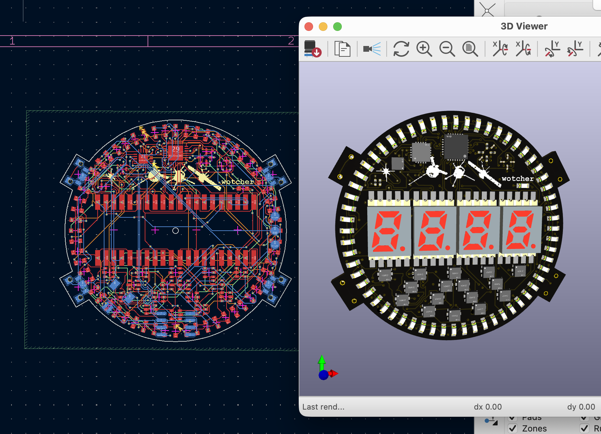
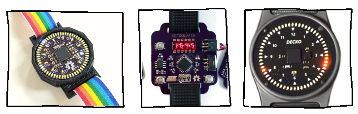

## wotcher

Wotcher a digital raise-to-wake LED watch. It's inspired by various retro-style watches, such as the aptly named retrowatch, the charlie watch, and the decko circuit face watch, as well as other pinterest pictures lol.

<i>from left to right, <a src="https://trmm.net/Charliewatch/">charliewatch</a>, <a src="https://github.com/RafaelRiber/RetroWatch">retrowatch</a>, decko (by the Terminelectro company)</i>

## circuit design

Charlieplexing is a method to limit current & control many LED's with only a couple of microcontroller pins, by switching between LEDs really fast so it looks like they're always on. Human persistence of vision makes it look like many LEDs are on at once!

My project uses a charlieplexing chip (IS31FL3731-QF) to drive the 7-segment display & all 60 LEDs, which is 88 LEDs in total. 

## other cool chips

The clock chip (DS3231MZ+) is necessary here because the ATtiny's internal RC oscillator clock is terrible at time keeping. The clock chip only drifts like 2 seconds a year! So that's cool.

I'm also including an accelerometer so that it's raise-to-wake, like those Apple watches.

## features

I'm going to use embedded c++ to code this! I'll be prototyping on a breadboard.

## checklist

- [x] It has a complete CAD assembly, with all components (including electronics)
- [] you have firmware present, even if it’s untested
- [x] You have asked for feedback from other people about your design

Your GitHub repository contains all of your files:

- [x] a BOM, in CSV format in the root directory, WITH LINKS

- [x] the source files for your PCB, if you have one (.kicad_pro, .kicad_sch, gerbers.zip, etc)

- [x] A .STEP file of your project’s 3D CAD model (and ideally the source design file format as well - .f3d, .FCStd, etc)

- [-] ANY other files that are part of your project (firmware, libraries, references, etc)